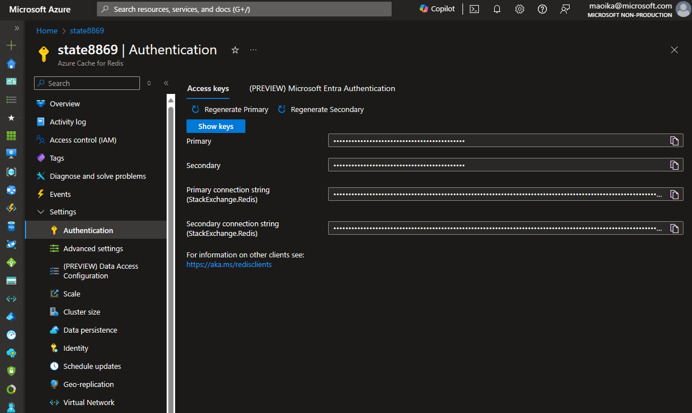

# ASP.NET Session State Provider for Azure Cache for Redis

 
 
[](https://azure.microsoft.com)


## Scenario

The main objective of this LAB is do demonstrate the state service of .NET Framework 4.8 on Azure Cache for Redis as a provider. The main document is https://learn.microsoft.com/en-us/azure/azure-cache-for-redis/cache-aspnet-session-state-provider
ASP.NET provides some providers for the Session State, and Azure Cache for Redis is one of them.

# Prerequisites

- An Azure account with an active subscription. [Create an account for free](https://azure.microsoft.com/free/?WT.mc_id=A261C142F).

## Create Environment

Create Resource Group

```bash
az group create \
    --name redis-state \
    --location brazilsouth
```

Create Azure Cache for Redis

```bash

let "randomIdentifier=$RANDOM"

az redis create --location brazilsouth --name state$randomIdentifier --resource-group redis-state --sku Basic --vm-size c0
```

## Get Credentials
In Azure Portal, in Autorization section, get the credentials for the created Azure Cache for Redis


## Setup Code with Azure Cache for Redis
Create a file named connections.config in the project and save the folowing xml:

```xml
<connectionStrings>
  <add name="OikawaRedisConnString" connectionString="[yourredis].redis.cache.windows.net:6380,password=[your password],ssl=True,abortConnect=False"  />
</connectionStrings>

```

# How to run this Lab

Hit F5, or deploy in some web hosting, like Azure App Service.


## Verify the cache

1. Click on tab Verify Cache to see that no Session and therefore, no cache hit


2. Click on tab Load Cache to load Sessions


3. Click on tab Verify to see the cache hit


4. Click on button Add $100 to modify product session, and therefore the cache


## Verify the cache on Azure Redis
You can see the cache in a tool like Redis Insight, to see the cache working


## Next steps


## Learn more

## Contributing

This project welcomes contributions and suggestions.  Most contributions require you to agree to a
Contributor License Agreement (CLA) declaring that you have the right to, and actually do, grant us
the rights to use your contribution. For details, visit https://cla.opensource.microsoft.com.

When you submit a pull request, a CLA bot will automatically determine whether you need to provide
a CLA and decorate the PR appropriately (e.g., status check, comment). Simply follow the instructions
provided by the bot. You will only need to do this once across all repos using our CLA.

This project has adopted the [Microsoft Open Source Code of Conduct](https://opensource.microsoft.com/codeofconduct/).
For more information see the [Code of Conduct FAQ](https://opensource.microsoft.com/codeofconduct/faq/) or
contact [opencode@microsoft.com](mailto:opencode@microsoft.com) with any additional questions or comments.

## Trademarks

This project may contain trademarks or logos for projects, products, or services. Authorized use of Microsoft 
trademarks or logos is subject to and must follow 
[Microsoft's Trademark & Brand Guidelines](https://www.microsoft.com/en-us/legal/intellectualproperty/trademarks/usage/general).
Use of Microsoft trademarks or logos in modified versions of this project must not cause confusion or imply Microsoft sponsorship.
Any use of third-party trademarks or logos are subject to those third-party's policies.